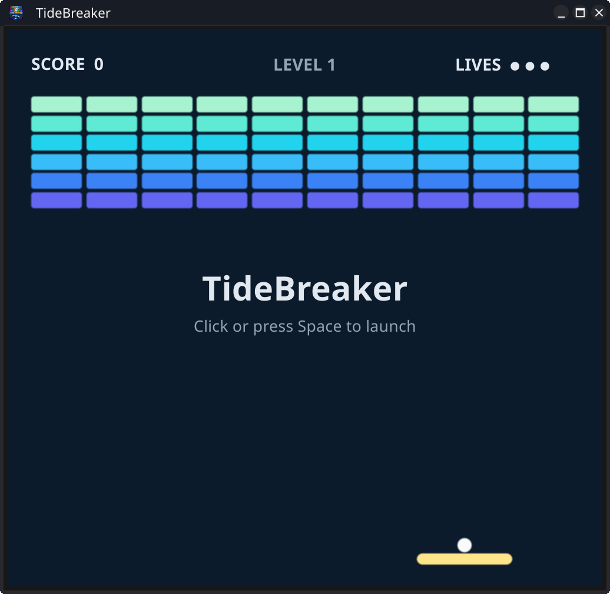
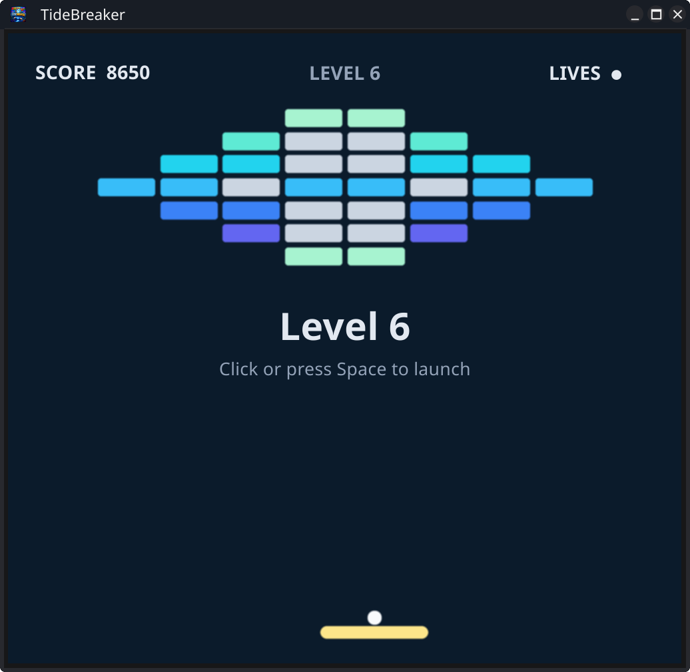

# TideBreaker

A nostalgic, single-player **breakout** clone built with [Fyne](https://fyne.io).
Steer your paddle, keep the ball in play, and break as many ocean-blue blocks as
you can. Clear the board and the tide rises — the next level launches faster.
The game ends when your lives run out.


## Screenshots





## Play

```sh
go run .
```

To build a standalone binary:

```sh
go build -o tidebreaker .
./tidebreaker
```

## Controls

| Input | Action |
| --- | --- |
| Mouse move / `←` `→` / `A` `D` | Move the paddle |
| `Space` | Launch the ball · pause / resume · play again |
| `P` | Pause / resume |
| `R` | Restart |

## How it plays

- **Three lives.** Lose one whenever the ball slips past your paddle. At zero, it's game over.
- **Score by row.** Higher rows are worth more (60 at the top down to 10 at the bottom).
- **Paddle angle.** Where the ball hits the paddle steers its bounce — catch it
  near the edge to angle a shot, hit it dead-centre to send it straight back up.
- **Rising tide.** Each broken brick nudges the ball a little faster, and every
  cleared board starts the next board layout quicker still. Survive as long as you can.
